# 🏪 End-To-End Sales Data Warehouse

A complete, production-style **Sales Data Warehouse** built with SQL Server, SSIS, and Power BI — covering the full ETL pipeline from raw data ingestion to interactive analytics dashboards.

---

## 📌 Project Overview

This project implements a **multi-layer data warehouse architecture** for a global retail sales dataset. It demonstrates end-to-end data engineering skills including data ingestion, transformation, dimensional modeling, and business intelligence reporting.

| Layer | Database | Description |
|-------|----------|-------------|
| 🟡 ODS | `ODS` | Operational Data Store — raw data as-is from the source |
| 🟠 STG | `STG` | Staging Layer — data cleansing, type casting & DIM tables |
| 🟢 DWH | `DWH` | Data Warehouse — Star Schema for analytics |

> 📦 **Dataset:** [SuperStore Sales Dataset — Kaggle](https://www.kaggle.com/datasets/laibaanwer/superstore-sales-dataset)

---

## 🛠️ Tech Stack

| Tool | Version | Purpose |
|------|---------|---------|
| SQL Server | 2022 | Database engine for all 3 layers |
| SSMS | 2022 | Database management & scripting |
| Visual Studio + SSIS | 2022 | ETL pipeline development |
| Power BI Desktop | Latest | Dashboard & analytics reporting |

---

## 🗂️ Repository Structure

```
End-To-End-Sales-DWH/
│
├── 📁 ODS/
│   └── ODS_Script.sql          # Raw source table (21 columns, all nvarchar)
│
├── 📁 STG/
│   └── STG_Script.sql          # STG_OBT + 7 DIM tables with proper data types
│
├── 📁 DWH/
│   └── DWH_Script.sql          # Star Schema: 1 Fact + 7 Dimension tables
│
├── 📁 SSIS/
│   ├── ODS.dtsx                # Package 1: Excel Source → ODS
│   ├── STG.dtsx                # Package 2: ODS → STG (transformations & DIMs)
│   ├── DWH (1).dtsx            # Package 3: STG → DWH (FK Lookups & Fact load)
│   ├── Sales_Project.dtproj    # SSIS Project file
│   └── Project.params          # Project parameters
│
├── 📁 PowerBI/
│   └── Sales_BI.pbix           # Interactive sales dashboard
│
├── 📁 Images/                  # Project screenshots
└── README.md
```

---

## ⚙️ ETL Pipeline (SSIS)

The pipeline consists of **3 sequential SSIS packages**:

```
📥 Excel Source (SuperStore Dataset)
        ↓
  [ODS.dtsx] ──── Load raw data as-is → ODS Database
        ↓
  [STG.dtsx] ──── Clean + Cast types + Build DIM tables → STG Database
        ↓
  [DWH.dtsx] ──── FK Lookups + Load Fact & Dims → DWH Database
        ↓
📊 Power BI Dashboard
```

---

## 🟡 Layer 1 — ODS (Operational Data Store)

Raw data loaded directly from Excel with no transformations. All columns stored as `nvarchar(255)`.

### ODS Table Structure
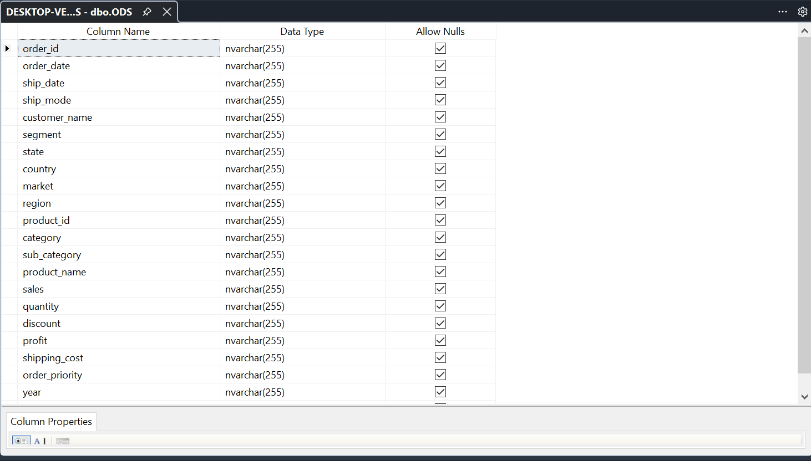

### SSIS Package — ODS
Simple **Excel Source → OLE DB Destination** pipeline.

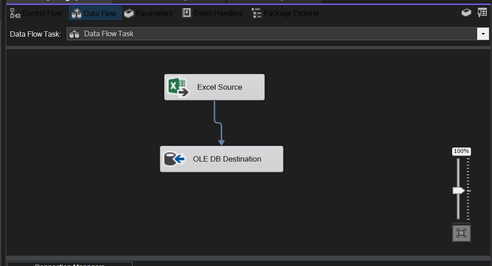

---

## 🟠 Layer 2 — STG (Staging)

Data is cleansed, types are cast to proper formats, and **7 DIM tables** are built alongside the main `STG_OBT` table.

### STG Tables
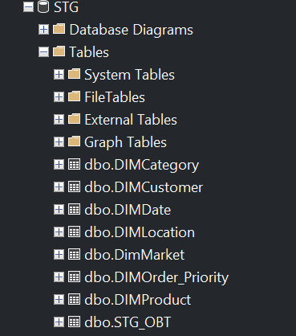

### STG Database Diagram
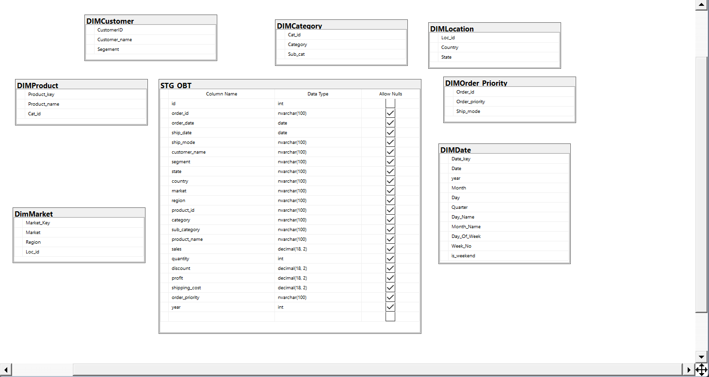

### SSIS Package — STG (Control Flow)
Sequence Container with TRUNCATE → Load flow for all DIM tables.

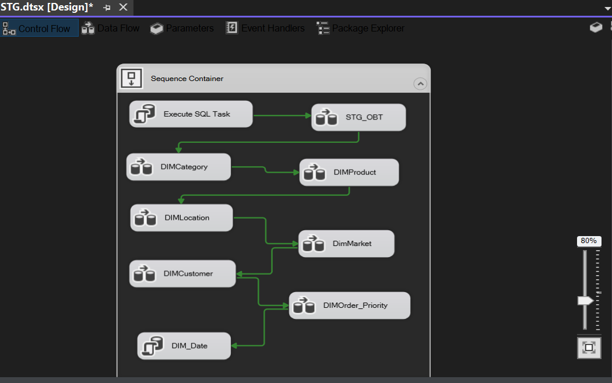

### STG Execute SQL Task (TRUNCATE before load)
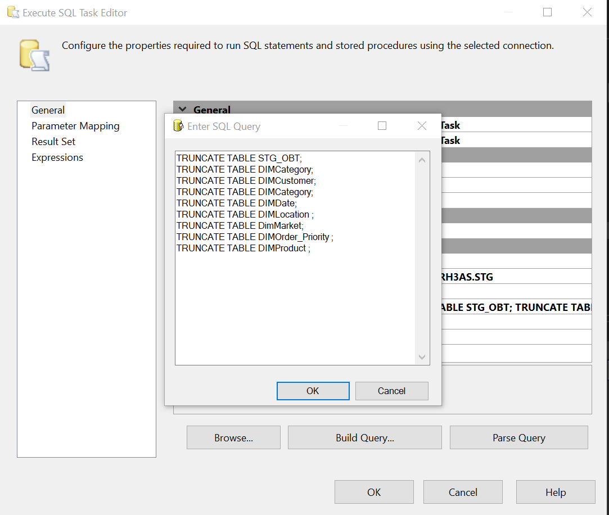

---

## 🟢 Layer 3 — DWH (Data Warehouse)

Star Schema with **1 Fact table** and **7 Dimension tables**.

### DWH Tables
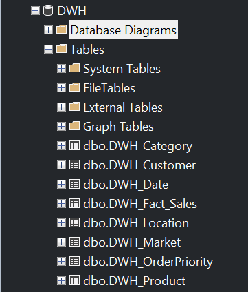

### Star Schema Diagram
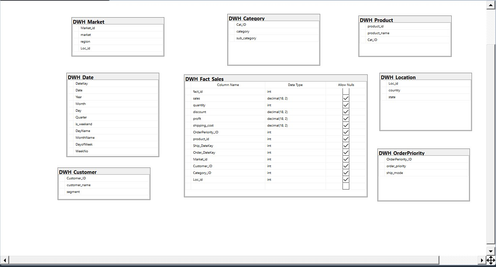

### Fact Table Design
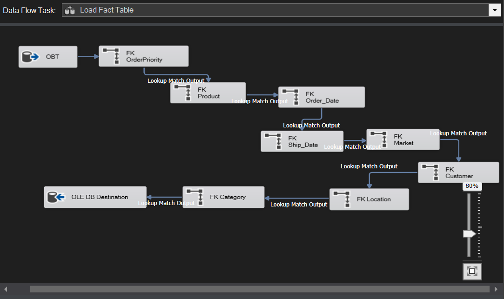

### SSIS Package — DWH (Control Flow)
Loads all Dimensions first, then the Fact Table using FK Lookups.

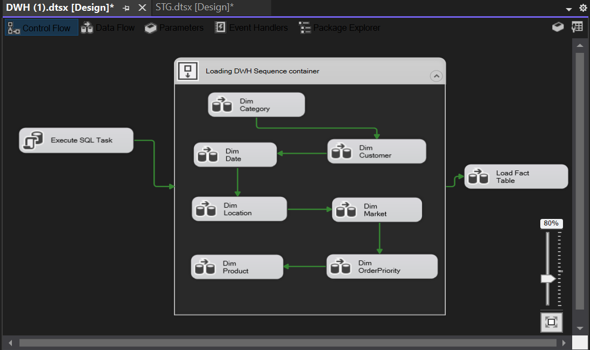

---

## 🌟 Star Schema

```
                    DWH_Date (Ship & Order)
                         │
   DWH_Customer ─────────┤
   DWH_Product  ─────────┤
   DWH_Category ─────────┼──── DWH_Fact_Sales ────┬── sales
   DWH_Location ─────────┤                         ├── quantity
   DWH_Market   ─────────┤                         ├── discount
   DWH_OrderPriority ────┘                         ├── profit
                                                   └── shipping_cost
```

---

## 📊 Power BI Dashboard

### Sales Overview
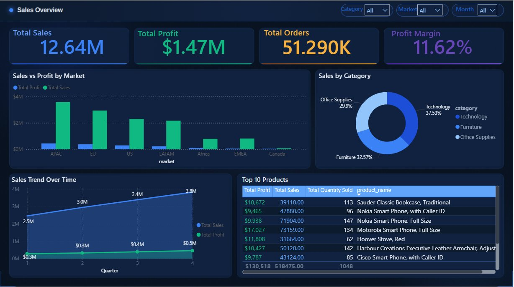

**KPIs:** Total Sales: $12.64M | Total Profit: $1.47M | Total Orders: 51.29K | Profit Margin: 11.62%

### Customer & Product Analysis
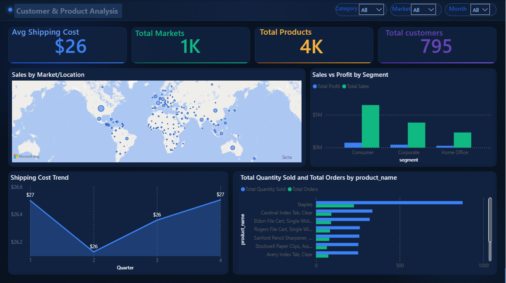

**KPIs:** Avg Shipping Cost: $26 | Total Markets: 1K | Total Products: 4K | Total Customers: 795

---

## 🚀 How to Run This Project

### Prerequisites
- SQL Server 2022
- Visual Studio 2022 with SSIS extension
- Power BI Desktop

### Steps

**1. Create the Databases — Run in SSMS in this order:**
```sql
-- 1. ODS/ODS_Script.sql
-- 2. STG/STG_Script.sql
-- 3. DWH/DWH_Script.sql
```

**2. Run SSIS Packages — in Visual Studio:**
```
1. Open SSIS/Sales_Project.dtproj
2. Update connection strings to your SQL Server instance
3. Run packages in order: ODS.dtsx → STG.dtsx → DWH (1).dtsx
```

**3. Open Power BI Dashboard:**
```
1. Open PowerBI/Sales_BI.pbix
2. Update data source to your SQL Server instance
3. Refresh data
```

---

## 👤 Author

**Taha Khallaf**
- GitHub: [@taha11khallaf11](https://github.com/taha11khallaf11)

---

> 💡 *This project was built as a complete end-to-end demonstration of modern data warehousing practices using the Microsoft BI Stack.*
